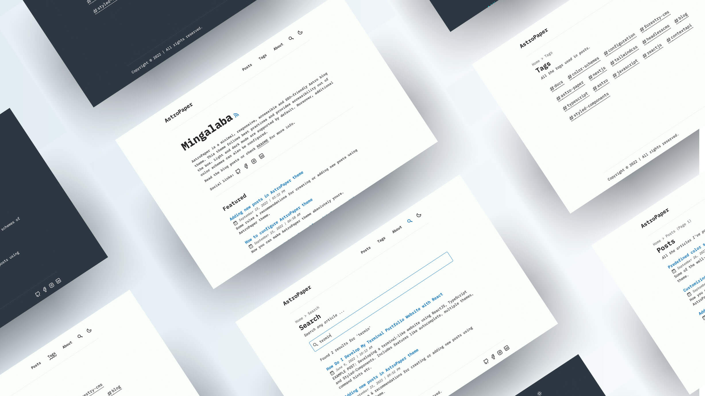

# AstroPaper 📄


[](https://www.figma.com/community/file/1356898632249991861)


[](https://conventionalcommits.org)
[](http://commitizen.github.io/cz-cli/)

AstroPaper is a minimal, responsive, accessible and SEO-friendly Astro blog theme. This theme is designed and crafted based on [my personal blog](https://satnaing.dev/blog).

This theme follows best practices and provides accessibility out of the box. Light and dark mode are supported by default. Moreover, additional color schemes can also be configured.

This theme is self-documented \_ which means articles/projects in this theme can also be considered as documentations. Read [the blog posts](https://astro-paper.pages.dev/projects/) or check [the README Documentation Section](#-documentation) for more info.

## 🔥 Features

- [x] type-safe markdown
- [x] super fast performance
- [x] accessible (Keyboard/VoiceOver)
- [x] responsive (mobile ~ desktops)
- [x] SEO-friendly
- [x] light & dark mode
- [x] fuzzy search
- [x] draft posts & pagination
- [x] sitemap & rss feed
- [x] followed best practices
- [x] highly customizable
- [x] dynamic OG image generation for blog posts [#15](https://github.com/astro-paper/pull/15) ([Blog Post](https://astro-paper.pages.dev/projects/dynamic-og-image-generation-in-astropaper-blog-posts/))

_Note: I've tested screen-reader accessibility of AstroPaper using **VoiceOver** on Mac and **TalkBack** on Android. I couldn't test all other screen-readers out there. However, accessibility enhancements in AstroPaper should be working fine on others as well._

## ✅ Lighthouse Score

<p align="center">
  <a href="https://pagespeed.web.dev/report?url=https%3A%2F%2Fastro-paper.pages.dev%2F&form_factor=desktop">
    
  <a>
</p>

## 🚀 Project Structure

Inside of AstroPaper, you'll see the following folders and files:

```bash
/
├── public/
│   ├── assets/
│   │   └── logo.svg
│   │   └── logo.png
│   └── favicon.svg
│   └── astropaper-og.jpg
│   └── robots.txt
│   └── toggle-theme.js
├── src/
│   ├── assets/
│   │   └── socialIcons.ts
│   ├── components/
│   ├── content/
│   │   |  blog/
│   │   |    └── some-blog-posts.md
│   │   └── config.ts
│   ├── layouts/
│   └── pages/
│   └── styles/
│   └── utils/
│   └── config.ts
│   └── types.ts
└── package.json
```

Astro looks for `.astro` or `.md` files in the `src/pages/` directory. Each page is exposed as a route based on its file name.

Any static assets, like images, can be placed in the `public/` directory.

All blog posts are stored in `src/content/blog` directory.


## 💻 Tech Stack

**Main Framework** - [Astro](https://astro.build/)  
**Type Checking** - [TypeScript](https://www.typescriptlang.org/)  
**Component Framework** - [ReactJS](https://reactjs.org/)  
**Styling** - [TailwindCSS](https://tailwindcss.com/)  
**UI/UX** - [Figma Design File](https://www.figma.com/community/file/1356898632249991861)  
**Fuzzy Search** - [FuseJS](https://fusejs.io/)  
**Icons** - [Boxicons](https://boxicons.com/) | [Tablers](https://tabler-icons.io/)  
**Code Formatting** - [Prettier](https://prettier.io/)  
**Deployment** - [Cloudflare Pages](https://pages.cloudflare.com/)  
**Illustration in About Page** - [https://freesvgillustration.com](https://freesvgillustration.com/)  
**Linting** - [ESLint](https://eslint.org)

## 👨🏻‍💻 Running Locally

You can start using this project locally by running the following command in your desired directory:

```bash
# npm 6.x
npm create astro@latest --template astro-paper

# npm 7+, extra double-dash is needed:
npm create astro@latest -- --template astro-paper

# yarn
yarn create astro --template astro-paper

# pnpm
pnpm dlx create-astro --template astro-paper
```


| Command                              | Action                                                                                                                           |
| :----------------------------------- | :------------------------------------------------------------------------------------------------------------------------------- |
| `npm install`                        | Installs dependencies                                                                                                            |
| `npm run dev`                        | Starts local dev server at `localhost:4321`                                                                                      |
| `npm run build`                      | Build your production site to `./dist/`                                                                                          |
| `npm run preview`                    | Preview your build locally, before deploying                                                                                     |
| `npm run format:check`               | Check code format with Prettier                                                                                                  |
| `npm run format`                     | Format codes with Prettier                                                                                                       |
| `npm run sync`                       | Generates TypeScript types for all Astro modules. [Learn more](https://docs.astro.build/en/reference/cli-reference/#astro-sync). |
| `npm run lint`                       | Lint with ESLint                                                                                                                 |
| `docker compose up -d`               | Run AstroPaper on docker, You can access with the same hostname and port informed on `dev` command.                              |
| `docker compose run app npm install` | You can run any command above into the docker container.                                                                         |
| `docker build -t astropaper .`       | Build Docker image for AstroPaper.                                                                                               |
| `docker run -p 4321:80 astropaper`   | Run AstroPaper on Docker. The website will be accessible at `http://localhost:4321`.                                             |

